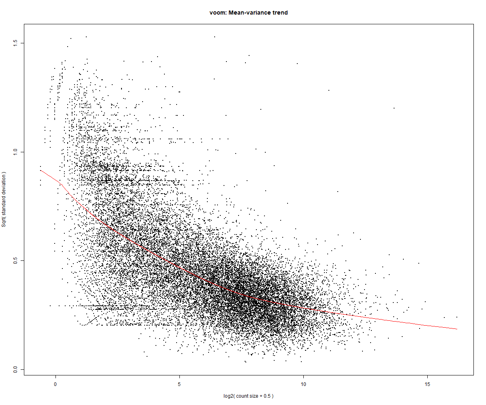
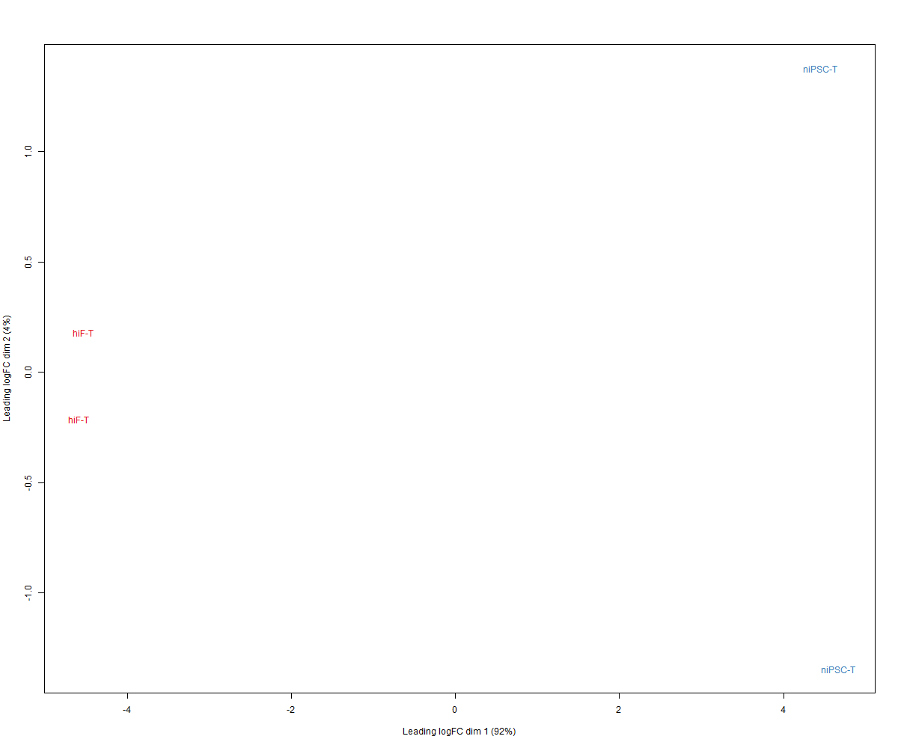
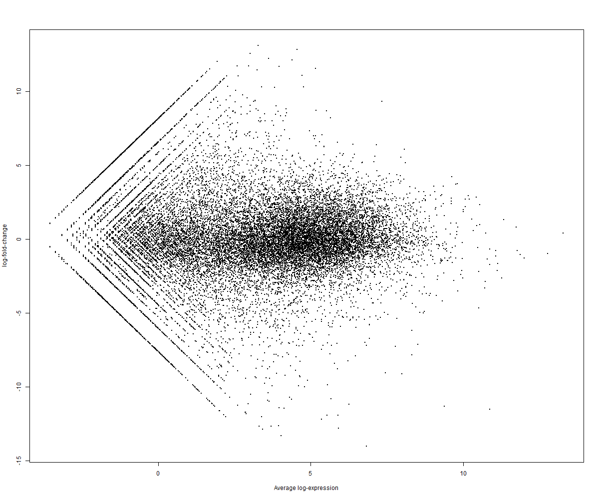
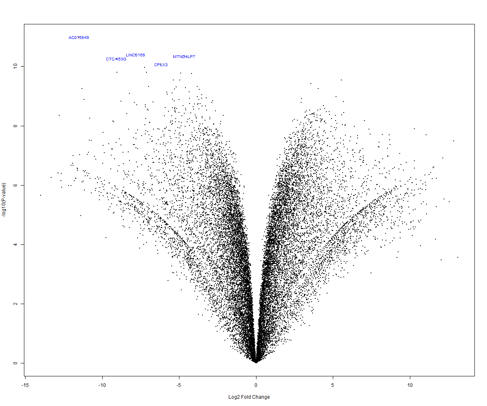
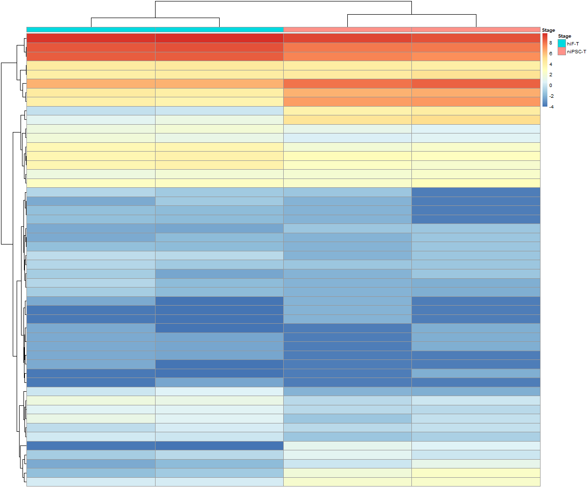

# Resultados e interpretación – Expresión diferencial hiF-T vs niPSC-T

El contraste evaluado corresponde a:

> logFC = niPSC-T − hiF-T

Por lo tanto: - logFC positivo → mayor expresión en células pluripotentes inducidas - logFC negativo → mayor expresión en fibroblastos

------------------------------------------------------------------------

## Calidad del modelo estadístico

### Relación media-varianza (voom)

La tendencia decreciente observada indica que la varianza depende de la media, comportamiento característico de datos de RNA-seq.\
Esto confirma que `voom` asignó pesos adecuados a cada gen y que el modelo lineal puede aplicarse correctamente.

**Interpretación:**  los resultados de expresión diferencial son estadísticamente confiables dentro de las limitaciones del tamaño muestral.

------------------------------------------------------------------------

## Organización global del transcriptoma

### MDS

La primera dimensión separa completamente ambas condiciones.

**Interpretación biológica:**

El principal determinante de la variación transcriptómica es el estado celular. La reprogramación no genera pequeñas diferencias, sino un cambio global de identidad.

Esto indica que fibroblasto y iPSC corresponden a estados transcriptómicos distintos.

------------------------------------------------------------------------

## Magnitud del cambio transcriptómico

### MA plot

Se observa dispersión vertical amplia a lo largo de todo el rango de expresión.

**Interpretación:**\
El cambio no se limita a genes de baja expresión ni a reguladores específicos. También afecta genes estructurales abundantes, lo que indica remodelación transcriptómica generalizada.

------------------------------------------------------------------------

### Volcano plot

Se observan genes altamente significativos en ambos extremos.

**Interpretación:**\
Existen dos programas transcriptómicos opuestos activos simultáneamente: - activación del programa pluripotente - silenciamiento del programa fibroblástico

No se trata de un cambio gradual sino de un cambio de estado celular.

------------------------------------------------------------------------

## Genes característicos de cada estado

### Heatmap (Top 50 genes)

Las muestras se agrupan perfectamente por condición.

**Interpretación:**\
Un subconjunto pequeño de genes es suficiente para distinguir completamente los estados celulares, lo que indica la presencia de genes marcadores de identidad.

Ejemplos biológicamente consistentes:

**Activados en iPSC** - UTF1 - LIN28A - DNMT3L - FGF4

Asociados a pluripotencia y autorrenovación.

**Activados en fibroblasto** - COL1A2 - COL6A3 - TNC - THBS2

Asociados a matriz extracelular y adhesión celular.

------------------------------------------------------------------------

## Interpretación integrada

Todos los análisis apuntan al mismo fenómeno:

-   El MDS muestra separación completa de estados
-   El MA indica cambio global
-   El Volcano revela programas opuestos
-   El Heatmap identifica genes marcadores

En conjunto, los datos muestran que la reprogramación celular implica una transición entre estados transcriptómicos estables más que cambios aislados en genes individuales.

------------------------------------------------------------------------

## Limitaciones

-   n = 2 por grupo
-   posible inflación de significancia
-   no se evaluaron efectos de lote

------------------------------------------------------------------------

## Conclusión

El análisis revela una reorganización transcriptómica masiva consistente con un cambio de identidad celular completo.\
La concordancia entre resultados estadísticos y funciones biológicas conocidas respalda la validez del análisis.
